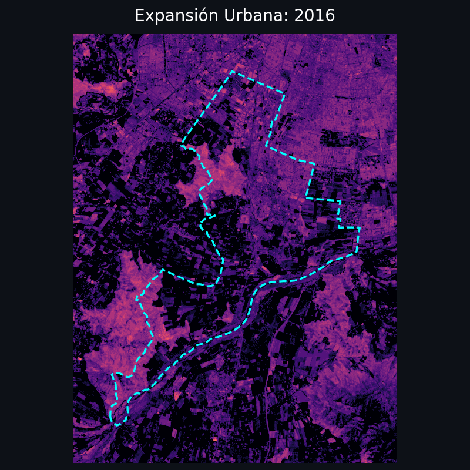
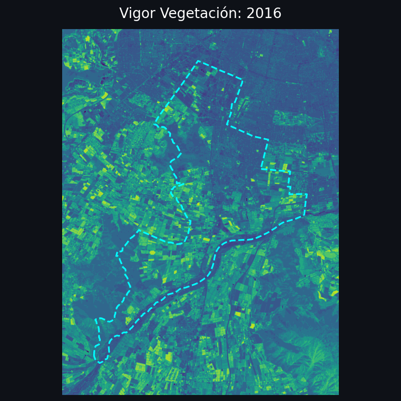

# 🛰️ Monitoreo de Cambio Urbano en San Bernardo (2016-2026)

[](https://www.python.org/)
[](https://sentinel.esa.int/web/sentinel/missions/sentinel-2)
[](https://streamlit.io/)
[](https://www.docker.com/)

Este repositorio contiene un flujo de trabajo geoinformático avanzado para detectar, cuantificar y visualizar la expansión urbana en la comuna de **San Bernardo, Chile**. Utilizando imágenes multiespectrales de **Sentinel-2 L2A**, analizamos una década de transformaciones espaciales (2016-2026) con una resolución de 10 metros.

---

## 🎞️ Animaciones Temporales (Time-lapses)

Visualización de la evolución rítmica de la comuna durante el periodo de estudio:

| **Expansión Urbana (NDBI)** | **Vigor de Vegetación (NDVI)** |
|:---:|:---:|
|  |  |

---

## 🚀 Arquitectura del Proyecto

El proyecto está organizado de forma modular para permitir tanto la ejecución guiada (Notebooks) como el procesamiento masivo (Scripts):

*   📂 `notebooks/`: Pipeline paso a paso desde la búsqueda STAC hasta el análisis zonal.
*   📂 `app/`: Código fuente del Dashboard interactivo.
*   📂 `scripts/`: Módulos de procesamiento (cálculo de índices, detección de cambios, generador de GIFs).
*   📂 `data/`:
    *   `raw/`: Imágenes originales (ZIP).
    *   `processed/`: Índices espectrales (GeoTIFF) y estadísticas (CSV).
    *   `vector/`: Límites municipales y grillas de análisis (GeoPackage).
*   📂 `outputs/`: Figuras, animaciones temporales y resultados finales.

---

## 🛠️ Instalación y Requisitos

La forma más sencilla de ejecutar el entorno completo (Jupyter + Dashboard) es vía Docker:

1.  **Clonar el repositorio:**
    ```bash
    git clone https://github.com/onlyG19/laboratorio2-geoinformatica-cambio-urbano.git
    cd laboratorio2-geoinformatica-cambio-urbano
    ```

2.  **Levantar el entorno:**
    ```bash
    docker-compose up -d
    ```

3.  **Accesos:**
    *   **Dashboard:** [http://localhost:8501](http://localhost:8501)
    *   **Jupyter Lab:** [http://localhost:8888](http://localhost:8888)

---

## 📊 Metodología de Análisis

El flujo técnico sigue estos pilares fundamentales:

1.  **Adquisición Programática:** Uso de API STAC para filtrar imágenes con nubosidad < 5%.
2.  **Álgebra de Mapas:** Cálculo de índices biofísicos:
    *   **NDVI:** Vigor de la vegetación.
    *   **NDBI:** Respuesta espectral de superficies construidas.
    *   **BSI:** Índice de suelo desnudo para filtrar áreas agrícolas.
3.  **Detección Lógica de Cambios:** Algoritmo que identifica "Urbanización" cuando el NDBI cruza el umbral positivo y el NDVI desciende críticamente.
4.  **Estadística Zonal:** Agregación de cambios en grillas de 500m para identificar polos de crecimiento industrial y residencial.

---

## 📦 Datos Originales (Raw Data)

Las imágenes satelitales Sentinel-2 L2A utilizadas en este estudio fueron obtenidas desde el [Copernicus Data Space Browser](https://browser.dataspace.copernicus.eu). Debido a su tamaño (aprox. 1.2 GB c/u), estos archivos están excluidos del repositorio vía `.gitignore`.

**Detalle de productos en `data/raw/`:**
*   `S2A_MSIL2A_20160305...SAFE.zip` (Marzo 2016)
*   `S2B_MSIL2A_20171110...SAFE.zip` (Noviembre 2017)
*   `S2B_MSIL2A_20190514...SAFE.zip` (Mayo 2019)
*   `S2B_MSIL2A_20210324...SAFE.zip` (Marzo 2021)
*   `S2A_MSIL2A_20231015...SAFE.zip` (Octubre 2023)
*   `S2C_MSIL2A_20260122...zip` (Enero 2026)

---

## 📑 Entregables y Funcionalidades

### 📈 Dashboard Interactivo
*   **Mapa Coroplético:** Visualización de la intensidad de urbanización (Ha) por cuadrantes.
*   **Comparador Visual:** Herramienta "Antes vs Después" para validar cambios espectrales.
*   **Línea de Tiempo:** Gráficos dinámicos de la evolución media de los índices.
*   **Time-lapses:** Generación automática de GIFs de la expansión urbana.

### 📄 Reporte e Información
Se incluye una estructura de notebooks lista para ser exportada como informe técnico, cumpliendo con los requerimientos de la Facultad de Ingeniería de la USACH.

---

## 🤝 Autor
*   **Byron Gracia** - *Geoinformática, Departamento de Ingeniería Informática, USACH.*

---
*Nota: Este proyecto fue desarrollado como parte del Laboratorio 2 del curso de Geoinformática, 2026.*
